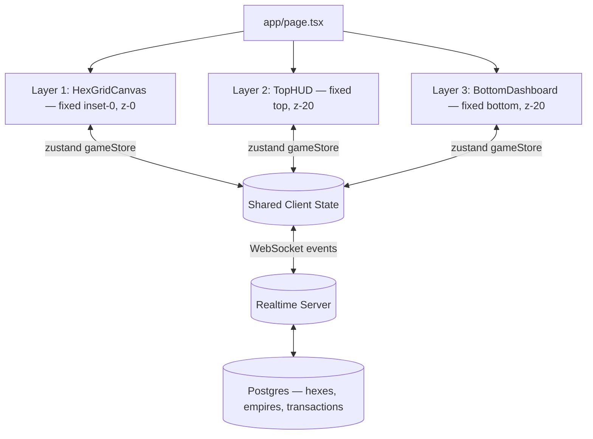

# HEX WARS: AD TAKEOVER — Technical Architecture Blueprint

Real-time multiplayer ad-takeover strategy game. Companies buy hexes on a shared isometric map by paying to plant their domain's brand on a tile; anyone can hostile-takeover an occupied tile for 1.5x the last price paid. Last empire standing (or highest empire by valuation at war-end) wins the season.

## 1. Executive Summary

Three architectural problems dominate this build, in order of risk:

1. **Concurrency correctness** — two attackers can click "take over" on the same hex within milliseconds. Whoever's payment settles first must win, atomically, with the loser refunded. This is a database/transaction problem before it is a rendering problem.
2. **Rendering 500+ animated, textured, glowing hex prisms at 60fps** — naive one-mesh-per-hex kills frame rate once the map fills up. Empty hexes must be one instanced draw call; only occupied/contested hexes (a small, changing subset) get individual meshes with logo textures and emissive rims.
3. **Perceived liveness** — the whole pitch of the product is "the map is alive." Every panel (ticker, revenue counter, hall of fame) must feel like it's reacting to a shared world, which means a single real-time event stream feeding every UI surface, not per-component polling.

Everything below is organized around solving those three problems first; the visual polish (glassmorphism, neon glows, particle bursts) is the easy 80% once the data layer and render loop are right.

## 2. Tech Stack

| Layer | Choice | Why |
|---|---|---|
| Framework | Next.js 14 (App Router), React 18 | RSC for static shell (HUD chrome), client components for the interactive canvas/state |
| 3D Rendering | Three.js via `@react-three/fiber` + `@react-three/drei` | Declarative scene graph maps cleanly to "hexes = data," `drei`'s `Html`, `useTexture`, `Instances` cover 90% of needs without hand-rolled WebGL |
| Grid math | Hand-written axial/cube coordinate library (`lib/hex/hexMath.ts`) | No dependency justifies itself for ~150 lines of pure functions; keeps it fully typed and testable |
| Styling | Tailwind CSS | Utility classes match the "many small files" component style; arbitrary values needed for exact hex colors |
| Motion (2D/HUD) | Framer Motion | Panel entrances, counter pulses, ticker scroll, spring-physics logo drops |
| Motion (3D) | R3F `useFrame` + `@react-spring/three` (optional) for elevation/shockwave tweens | Framer Motion doesn't drive WebGL uniforms; keep 3D animation inside the R3F render loop |
| Client state | Zustand | Single source of truth for map state, selection, and UI mode; avoids prop-drilling through the canvas/HUD boundary |
| Real-time transport | WebSocket (Supabase Realtime, Ably, or a custom PartyKit/Socket.IO server — pick one, see §8) | Broadcasts hex-state deltas and market events to every connected client |
| Persistence | PostgreSQL (Supabase/Neon) | Row-level locking (`SELECT ... FOR UPDATE`) is the cheapest correct answer to the concurrent-takeover race |
| Audio | Web Audio API (no library) | Small, fixed set of one-shot SFX; a library is unjustified overhead |
| Icons | `lucide-react` | Matches spec |
| Validation | `zod` | Schema-validate every client→server payload (domain string, hex id, bid amount) at the API boundary |
| Testing | Vitest (unit, for `lib/hex` and pricing logic), Playwright (E2E, for the buy/takeover flow) | Pure grid math and pricing logic are cheap to unit test and are exactly the code you cannot afford to get wrong |

## 3. Design System

### 3.1 Color Tokens

```
--bg-base:          #0B0E14   /* deep obsidian, page background */
--grid-base:        #1E2638   /* empty hex fill */
--grid-border:      #2A364F   /* empty hex edge / metallic seam */
--accent-cyan:      #00F0FF   /* hover, selection, primary UI accent */
--accent-green:     #00FF87   /* revenue, success, "buy" CTAs */
--accent-coral:     #FF3366   /* active conflict, danger, under-attack alarm */
--accent-purple:    #8A2BE2   /* rare/legendary empire tier, secondary accent */

--glass-bg:         rgba(15, 18, 26, 0.55)   /* panel fill, use with backdrop-blur */
--glass-border:     rgba(255, 255, 255, 0.08)
--text-primary:     rgba(255, 255, 255, 0.92)
--text-muted:       rgba(255, 255, 255, 0.52)
```

Every brand's `primaryColor` (fetched at capital-purchase time, §6) is a *fifth, dynamic* accent — it is the only color allowed to appear on the grid itself outside the palette above, so occupied territory always reads as visually distinct from system chrome.

Tailwind mapping lives in [tailwind.config.ts](tailwind.config.ts) under `colors.hexwars.*` and `boxShadow.glow-*`.

### 3.2 Typography

| Role | Font | Notes |
|---|---|---|
| Display / panel titles | `Space Grotesk` | Geometric, technical, matches the "financial trading platform" register |
| Body / labels | `Inter` | High legibility at small HUD sizes |
| Numeric readouts (revenue, timer, prices) | `JetBrains Mono`, `font-variant-numeric: tabular-nums` | Prevents digit-width jitter on live-updating counters — critical, since the whole HUD is animated numbers |

### 3.3 Spacing, Radius, Elevation

- Panel corner radius: `rounded-2xl` (16px). Buttons: `rounded-xl` (12px). Badges/pills: `rounded-full`.
- Panels float `16px`–`24px` off the viewport edge (`inset-4 md:inset-6`), never flush — reinforces the "floating HUD over a world" read.
- Glass panels: `bg-glass-bg backdrop-blur-2xl border border-glass-border`, plus a 1px inset highlight (`shadow-[inset_0_1px_0_rgba(255,255,255,0.06)]`) to sell the glass edge.
- Glow shadows are layered, never a single blurred box-shadow: one tight, one diffuse.
  ```
  shadow-glow-cyan:  0 0 0 1px rgba(0,240,255,.35), 0 0 24px rgba(0,240,255,.25)
  shadow-glow-green: 0 0 0 1px rgba(0,255,135,.35), 0 0 24px rgba(0,255,135,.25)
  shadow-glow-coral: 0 0 0 1px rgba(255,51,102,.4),  0 0 24px rgba(255,51,102,.3)
  ```

### 3.4 Motion Tokens

- Standard UI ease: `[0.16, 1, 0.3, 1]` (Framer's "expo-out" feel) — used for panel entrance, ticker items.
- Spring for anything that should feel "physical" (logo drop, button press): `{ type: 'spring', stiffness: 380, damping: 28 }`.
- Pulse loop (revenue counter tick, under-attack alarm): 1.2s ease-in-out, opacity/scale 1 → 1.08 → 1, `repeat: Infinity` only while the triggering state is true — never a decorative infinite loop, always state-driven.

## 4. Screen Architecture (3 Layers)



All three layers read/write one Zustand store ([lib/state/gameStore.ts](lib/state/gameStore.ts)); none of them talk to each other directly. This is what lets "click a hex in the 3D canvas" open "the buy panel in the bottom dashboard" without prop drilling across the DOM/WebGL boundary.

Layering is pure CSS stacking, not component nesting depth — Layer 1 is a full-bleed `<Canvas>`, Layers 2 and 3 are `position: fixed` DOM overlays with `pointer-events-none` on their outer wrapper and `pointer-events-auto` re-enabled only on interactive children, so clicks fall through to the 3D canvas everywhere except actual buttons/panels.

## 5. Component Tree / File Structure

```
app/
  layout.tsx                  # fonts, global providers
  page.tsx                    # assembles the 3 layers
  globals.css                 # Tailwind base + hex-noise bg texture
components/
  hexgrid/
    HexGridCanvas.tsx         # <Canvas>, camera, lights, scene assembly
    EmptyHexField.tsx         # single InstancedMesh for all unclaimed hexes
    BrandHexTile.tsx          # individual mesh for an occupied/contested hex
    useHexInteraction.ts      # raycasting hook: hover + click → hex coord
    HexTooltip.tsx            # drei <Html> floating tooltip
  hud/
    TopHUD.tsx                # composes the 3 HUD sections
    RevenueCounter.tsx        # pulsing $ counter
    LiveTicker.tsx            # scrolling event log
    CountdownTimer.tsx        # war-end countdown
  dashboard/
    BottomDashboard.tsx       # grid of the 4 panels
    GlassPanel.tsx            # shared glass-panel chrome
    HallOfFamePanel.tsx
    ConquerPanel.tsx
    HowItWorksPanel.tsx
    MarketDataPanel.tsx
lib/
  hex/
    hexMath.ts                # axial/cube coordinate math, pure functions
    hexMath.test.ts
  state/
    gameStore.ts               # zustand store, single source of truth
  pricing/
    takeoverPricing.ts         # price/multiplier rules, client-mirrors-server
  audio/
    soundEngine.ts             # Web Audio API one-shot SFX manager
types/
  game.ts                      # Hex, Empire, TakeoverEvent, MarketSnapshot
```

File sizes are kept in the 80–250 line range by splitting on responsibility (one hook, one panel, one math module per file) rather than by arbitrary line-count chopping.

## 6. Data Model

```ts
// types/game.ts (full file written separately)
type HexCoord = { q: number; r: number }

type Empire = {
  id: string
  domain: string           // "stripe.com" — derived from `url`'s hostname
  url: string              // full submitted URL — required for click-to-visit navigation (§16)
  name: string             // "Stripe"
  logoUrl: string          // resolved favicon/og:image (§15)
  primaryColorHex: string  // dominant brand color, drives emissive material
  ogTitle: string          // scraped og:title / <title>, resolved once at capital-purchase time
  ogDescription: string    // scraped og:description / meta description
  capitalHexId: string
  foundedAt: string        // ISO timestamp
  notifyWebhookUrl: string | null // opt-in only — see §18 on why this isn't an email address
}

type HexTile = {
  id: string
  coord: HexCoord
  ownerId: string | null
  isCapital: boolean
  lastPricePaidCents: number   // basis for next takeover price
  isContested: boolean         // true while a takeover attempt is in flight
  ownedSince: string | null
  lockedUntil: string | null   // "Protect Hex" upsell (§17) — blocks takeover execution until this time
}

type TakeoverEvent = {
  id: string
  hexId: string
  attackerEmpireId: string
  defenderEmpireId: string | null
  pricePaidCents: number
  createdAt: string
}

type MarketSnapshot = {
  totalWarRevenueCents: number
  activeConflicts: number
  totalTakeoverEvents: number
  avgRevenuePerTakeoverCents: number
  avgControlDurationSeconds: number
}
```

Brand logo/color resolution happens **server-side** at capital-purchase time (fetch favicon, extract dominant color via a library like `node-vibrant`, cache in the `Empire` row) — never client-side, so every viewer sees the same brand mark without re-fetching or re-computing it.

## 7. Hex Grid Math

Implemented in [lib/hex/hexMath.ts](lib/hex/hexMath.ts), following the standard axial-coordinate approach (the same math Civ-style hex games use):

- **Axial coordinates** `{q, r}` identify every hex; cube coordinates `{x, y, z}` (`x + y + z = 0`) are used internally for distance/rounding because they make neighbor and distance math trivial.
- `axialToPixel(hex, size)` — flat-top hex layout, returns the 2D world position; the Three.js scene then only needs to set `mesh.position.set(x, 0, z)` (Y is elevation, reserved for hover/animation).
- `pixelToHex(point, size)` — inverse transform, used as a fallback/debug path; the primary hover/click path uses **raycasting + instance ID**, not pixel math, because that's what R3F gives you for free and it's exact regardless of camera angle.
- `hexRound(cube)` — the classic "round each cube coordinate, fix the component with the largest rounding error" algorithm; needed because naive rounding of fractional cube coordinates can produce an invalid (non-zero-sum) hex.
- `hexNeighbors(hex)` — the 6 adjacent hexes, used for expansion/adjacency-merge logic and for the "swallow" elimination check (is this the empire's last hex?).
- `generateHexagonGrid(radius)` — produces every hex within `radius` rings of the origin, used once at map-init to seed `EmptyHexField`.

## 8. Real-Time Multiplayer Architecture

```mermaid
sequenceDiagram
    participant A as Client A (attacker)
    participant S as Realtime Server
    participant DB as Postgres
    participant B as Client B (all other viewers)

    A->>S: POST /api/hexes/:id/takeover { bidCents }
    S->>DB: BEGIN; SELECT hex FOR UPDATE
    DB-->>S: current lastPricePaidCents
    S->>S: requiredPrice = lastPricePaidCents * 1.5
    alt bidCents < requiredPrice
        S-->>A: 409 Conflict — price moved, refresh
    else bid accepted
        S->>DB: UPDATE hex owner, lastPricePaidCents; INSERT takeover_event; COMMIT
        S-->>A: 200 OK
        S->>B: broadcast hex:updated event
    end
```

Key decisions:

- **Server is the only writer.** The client never mutates `gameStore`'s map state directly on a buy/takeover action — it optimistically marks the hex `isContested: true` for instant feedback, then reconciles with whatever the server broadcasts. This avoids the two-attacker race ever reaching the render layer as a wrong answer.
- **`SELECT ... FOR UPDATE`** row-lock on the target hex is what actually prevents double-spend; the WebSocket layer is purely for fan-out, not for arbitrating who wins.
- **Every client subscribes to one channel** (`map:global`) and receives typed events: `hex:updated`, `empire:eliminated`, `market:snapshot`. HUD, canvas, and dashboard panels all derive from the same event stream via the Zustand store — no component owns its own polling loop.
- Pick **Supabase Realtime** if already on Postgres (get the DB row-lock and the pub/sub from one vendor); pick **PartyKit** or a small **Socket.IO** server if you want the room/broadcast model decoupled from the database.

## 9. Game Mechanics — Conquest Engine

- **Capital placement**: domain → server resolves favicon + brand color → client selects an empty hex → pay `BASE_HEX_PRICE_CENTS` → hex becomes that empire's capital.
- **Adjacency/expansion**: buying a hex adjacent to your own territory doesn't require special-casing in the data model — ownership is per-hex. The *visual* merge (one giant logo across a cluster) is a rendering concern: [BrandHexTile.tsx](components/hexgrid/BrandHexTile.tsx) groups same-owner adjacent hexes (via `hexNeighbors` flood-fill) into a single logo-texture footprint each render pass.
- **Takeover price**: `takeoverPricing.ts` — `requiredPrice = lastPricePaidCents * TAKEOVER_MULTIPLIER (1.5)`. This function is duplicated intentionally client-side (for instant UI price display) and server-side (as the actual source of truth) — the client's number is a preview, never trusted as payment authorization.
- **Elimination**: after any successful takeover, server checks `hexNeighbors`/ownership count for the defending empire; if it now owns zero hexes, emit `empire:eliminated`, which triggers the explosive elimination VFX on every client watching that region.

## 10. Animation & Audio System

- **Hover**: R3F `useFrame` lerps the hovered instance's Y position toward an elevated target (~0.15 world units) and lerps an emissive intensity uniform toward 1; both lerp back to 0 on hover-out. Driven inside the render loop, not Framer Motion (Framer can't touch instanced-mesh matrices).
- **Conquest burst** (on `hex:updated` with a prior owner): a fixed 4-stage sequence — (1) expanding ring mesh (`RingGeometry`, scaling + fading alpha over ~600ms), (2) a small `Points`-based particle burst in the defender's color, (3) the old logo plane scales/rotates apart and fades (a cheap stand-in for "shatter" — true per-fragment shatter is a v2 shader effect, flagged in §14), (4) new logo mesh drops in with a spring (`@react-spring/three`, overshoot then settle).
- **Audio** ([lib/audio/soundEngine.ts](lib/audio/soundEngine.ts)): a tiny Web Audio API wrapper with a preloaded buffer pool (`select`, `takeover`, `alarm`) and a single master `GainNode` wired to the HUD's mute toggle. The alarm loop only plays while `gameStore.isUnderAttack(myEmpireId)` is true, and is stopped explicitly on state change — never a fire-and-forget loop.

## 11. Performance Strategy

- **One draw call for all empty hexes** via `InstancedMesh` (`EmptyHexField.tsx`) — this is the single highest-leverage decision in the render architecture; a 500-hex map with individual meshes will not hold 60fps on mid-range hardware, instancing will.
- **Occupied hexes are the exception, not the rule** — even at a busy late-game state, occupied territory is a minority of the map, so paying per-mesh cost (logo texture, emissive rim) only there is cheap.
- **Texture atlas for brand logos**: as empires accumulate, load each logo once into a shared atlas/texture array rather than one texture per hex — avoids draw-call and VRAM blowup for large multi-hex empires.
- **Frustum culling** is free via Three.js defaults as long as hex geometry has correct bounding spheres (default for `CylinderGeometry`); no custom culling needed at this map scale.
- **Raycasting cost**: only raycast against `EmptyHexField`'s instanced mesh + the small array of occupied-hex meshes, never against decorative geometry (particles, rings, glow meshes) — tag those `raycast = () => null` or exclude via layers.

## 12. Security & Validation

- **Never trust a client-submitted price.** The takeover endpoint recomputes `requiredPrice` server-side from the DB row; the client's `bidCents` is only accepted if `>= requiredPrice` at lock time. Implemented: [app/api/checkout/create-session/route.ts](app/api/checkout/create-session/route.ts) computes the amount itself and ignores any amount the client might send.
- **URL input validation + SSRF guard**: implemented, not just planned. [lib/validation/targetUrlSchema.ts](lib/validation/targetUrlSchema.ts) checks well-formedness; [lib/security/ssrfGuard.ts](lib/security/ssrfGuard.ts) resolves the hostname and rejects private/loopback/link-local/cloud-metadata IPs — checked again immediately before every outbound fetch (not just at input time) to close the DNS-rebinding gap where a hostname resolves safely at validation and unsafely moments later. See §15 for the full metadata-fetch pipeline this protects.
- **Rate limiting**: per-IP and per-empire limits on takeover attempts (e.g. token bucket, 1 attempt per hex per empire per few seconds) to stop bot-driven flash-takeover spam from starving the row lock. Not yet implemented — flagged for the hardening phase (§13.7).
- **Idempotency key** on the takeover POST so client retry-on-timeout can't double-charge the same bid. Not yet implemented — the current checkout flow relies on Dodo's own session semantics; a dedicated idempotency key is still worth adding once a real database is wired up.
- **Webhook signature verification**: implemented in [lib/webhooks/verifyStandardWebhook.ts](lib/webhooks/verifyStandardWebhook.ts) — see §20. Skipping this check would let anyone forge a "payment succeeded" event and take hexes for free; it is the single most important check in the whole payments path.

## 13. Build Plan (Phases)

1. **Static shell** — `app/layout.tsx`, `app/page.tsx`, HUD + dashboard panels with mock/static data, no 3D yet. Validates the design system and layout in isolation.
2. **Hex math + static grid** — `lib/hex/hexMath.ts` with unit tests, `HexGridCanvas.tsx` rendering an `EmptyHexField` of a fixed radius, orbit-locked isometric camera.
3. **Interaction** — `useHexInteraction.ts` hover + click, `HexTooltip.tsx`, wiring selection into `gameStore` and the `ConquerPanel`.
4. **Persistence + real-time** — Postgres schema, takeover endpoint with row-locking, WebSocket broadcast, Zustand store subscribing to live events instead of mock data.
5. **Brand rendering** — favicon/color resolution pipeline, `BrandHexTile.tsx`, adjacency-merge logo footprint.
6. **Conquest FX + audio** — burst/shatter/drop sequence, `soundEngine.ts`, alarm-under-attack state.
7. **Hardening** — rate limiting, SSRF guard on favicon fetch, load-test the row-lock path under simulated simultaneous takeovers.

## 14. Open Questions / Next Steps

- True per-fragment "shatter" VFX (spec §4) needs a custom fragment shader (Voronoi-fractured plane) — phase-6 code above uses a cheaper scale/fade stand-in; flag if the shatter look is a hard requirement for launch.
- Logo/favicon rights: §15 resolved *how* metadata gets pulled (server-side, SSRF-guarded, from a URL the buyer themselves submitted about their own site) — it has not resolved the legal question of a "your brand gets attacked" game display a scraped mark without that party's consent for the *game* itself (as opposed to the buyer consenting to their own submission). Get real legal review before this goes further than a demo with real domains.
- Vendor pick for §8 (Supabase Realtime vs. PartyKit vs. custom) is left open — the architecture doesn't depend on which; pick based on what you're already running.
- §15–§21 below were added in response to a rapid sequence of scope-expanding requests in one session (metadata scraping, payments, analytics, monetization mechanics). They're implemented as real, working scaffold code, but the pace they arrived at is itself worth a note: this project grew from "dashboard UI + architecture doc" to "payments-enabled marketplace with third-party data scraping" within one sitting. Before building further on top of §17–§20 specifically, it's worth the team explicitly re-confirming product scope rather than continuing to accrete features turn-by-turn.

## 15. Metadata Scraping Pipeline (URL-Only Input)

The acquisition form has exactly one field: a target URL. No manual text, no uploads — everything shown on a hex (title, description, logo) is derived server-side from that URL.

- **Preview endpoint**: [app/api/brand/resolve/route.ts](app/api/brand/resolve/route.ts) — lets the buyer see what will appear before paying.
- **Authoritative resolution**: [lib/brand/resolveBrandMetadata.ts](lib/brand/resolveBrandMetadata.ts) — the *only* place that actually parses a fetched page. Both the preview endpoint and the checkout-session endpoint (§20) call this same function; the checkout step re-resolves independently rather than trusting whatever the preview call returned, so a tampered or stale client-side value can't end up embedded in a payment.
- **What it extracts**: `og:title`/`<title>`, `og:description`/meta description, and a logo (preferring `og:image`/apple-touch-icon from the page, falling back to Google's public favicon service — `https://www.google.com/s2/favicons?domain=…` — which needs no scraping and works even for sites with no Open Graph tags at all).
- **Extraction method**: targeted regex over the first ~100KB of HTML, not a full HTML parser. This is a deliberate scope call for a demo-stage app — it's fast and dependency-free, but a real DOM parser (e.g. a lightweight one, or `cheerio`) would be more robust against malformed markup and is worth swapping in before this handles high volumes of arbitrary real-world sites.
- **SSRF hardening** ([lib/security/ssrfGuard.ts](lib/security/ssrfGuard.ts)): this endpoint's entire job is "fetch a URL a stranger typed in," which is a textbook SSRF vector (see OWASP's SSRF entry). Defenses, all implemented:
  - Reject `http`/`https` only; reject the input at the schema level otherwise.
  - Resolve the hostname and reject private/loopback/link-local ranges (`10.x`, `172.16–31.x`, `192.168.x`, `127.x`, `169.254.x` — the last one specifically blocks cloud metadata endpoints like `169.254.169.254`) and IPv6 equivalents.
  - Re-check the resolved IP immediately before the actual fetch, not just at input validation — closes the DNS-rebinding gap (a hostname that resolves safely during validation but points somewhere private moments later).
  - Manual redirect handling (`redirect: 'manual'`), capped at 3 hops, with the SSRF check re-run on every hop — a redirect chain is exactly how a naive "validate then follow redirects automatically" implementation gets bypassed.
  - Request timeout (5s) and response size cap (2MB) so a malicious or huge target can't tie up a server thread or exhaust memory.
- The same `checkHostIsSafeToFetch` guard is reused in [lib/notifications/retaliationNotifier.ts](lib/notifications/retaliationNotifier.ts) (§18) for the same reason — anywhere the server fetches a URL someone else supplied needs this check, not just this one endpoint.

## 16. Dual-Interaction Click Model (Visit vs. Conquer)

Every occupied hex is simultaneously a piece of the game and a real, working outbound link — but a single click can't mean two different things depending on intent, so the interactions are split by *kind* of input, not by a mode toggle:

- **Plain click on an occupied hex** → `window.open(empire.url, '_blank', 'noopener,noreferrer')`. Implemented in [BrandHexTile.tsx](components/hexgrid/BrandHexTile.tsx). `noopener,noreferrer` matters here specifically because the destination is arbitrary, buyer-controlled, untrusted content — without it, the opened page could reach back into `window.opener` and redirect the game tab (a real phishing vector known as "tab-nabbing").
- **Hover (or right-click, as a touch/no-hover fallback)** → reveals the Conquest Card ([HexTooltip.tsx](components/hexgrid/HexTooltip.tsx)): scraped title/description, purchase price, live-viewer count (§19), and a **Conquer** button. Attacking a hex is always a deliberate click on that button — never a side effect of the plain click that visits the site.
- **Plain click on an empty hex** → still just selects it (populates the Quick Buy panel), since there's no site to visit yet.
- A real interaction-design snag this surfaced: the Conquest Card is a DOM overlay (`drei`'s `<Html>`) sitting visually on top of the WebGL canvas. Moving the pointer from the hex mesh onto the card's button crosses a real DOM element boundary, which fires the mesh's `pointerOut` and would otherwise hide the card before the click lands. [pointerOutGuard.ts](components/hexgrid/pointerOutGuard.ts) checks the browser's `relatedTarget` on that event and ignores the transition when the pointer landed on the card itself; the card's own `pointerLeave` handler does the symmetric check so it still closes when the pointer goes anywhere else.

## 17. Monetization Mechanics

Both implemented in [lib/pricing/takeoverPricing.ts](lib/pricing/takeoverPricing.ts) and [lib/hex/bulkClusters.ts](lib/hex/bulkClusters.ts):

- **"Protect Hex" upsell** — $15.00 (`PROTECTION_FEE_CENTS`) for 10 minutes (`PROTECTION_DURATION_MS`) of immunity from takeover, recorded as `HexTile.lockedUntil`. `assertTakeoverAllowed()` throws if a hex is still locked, and both the checkout-session endpoint and the webhook handler call it. **Deliberate simplification**: the original ask was that "the takeover price continues to escalate in the background" while locked — this implementation does *not* fabricate rising numbers with no real bids behind them (that would just be a different kind of fake-metric problem, see §19). The price shown is always the real 1.5x-of-last-actual-payment formula; a genuine "price climbs as a queue of rival bids stacks up during the lock window" mechanic would need an actual bid-queue data model, which is a real feature to design later, not something to simulate with invented numbers now.
- **"Mass Conquer" bulk discount** — 10% off (`BULK_DISCOUNT_RATE`) a 7-hex or 19-hex cluster (`BULK_CLUSTER_SIZES`). These sizes aren't arbitrary: `hexesInRadius(origin, 1)` and `hexesInRadius(origin, 2)` reuse the existing `generateHexagonGrid` ring math (§7) and produce exactly 7 and 19 hexes — a hex's immediate ring and next ring out — so the discount tiers are the map's natural geometry, not a made-up number. [BottomDashboard.tsx](components/dashboard/BottomDashboard.tsx) computes the actual cluster and its real summed price client-side for the preview; the checkout endpoint recomputes it server-side the same way as every other price in this app.

## 18. Retaliation Notifications — Why Webhook-Only, Not Email

The original ask was to email the previous owner an "you've been annexed, counter-attack" alert. This app has no signup and collects no email address — checkout is anonymous and URL-only (§15) — so there is no address on file to send that to. The only way to get one would be to scrape or guess it from the domain (`info@`, `admin@`, a WHOIS lookup) and then send unsolicited alert/marketing mail to it. That's a spam pattern regardless of how sympathetic the framing is, and it's also likely to violate CAN-SPAM/GDPR-style consent requirements depending on jurisdiction — so [lib/notifications/retaliationNotifier.ts](lib/notifications/retaliationNotifier.ts) doesn't do it.

What it does instead: `Empire.notifyWebhookUrl` is an **opt-in** field a buyer can set for their own empire at purchase time. If set, a takeover POSTs a small JSON payload to that URL — a normal, consent-based server-to-server integration pattern, not outreach to someone who never agreed to hear from this app. The webhook URL is itself run through the same SSRF guard as §15, since it's another case of "the server fetches a URL someone else supplied."

## 19. Live Visitor Count (DataFast) — and Why It's Never Fabricated

The product ask included showing something like "Exposing your brand to 1,420 live viewers right now" as trust/FOMO copy for advertisers. Since nothing here is deployed with real traffic yet, any number shown today would be invented — presenting a fake traffic count as real to influence a purchase decision is a dark pattern, and this app doesn't do it, even in an early demo.

What's actually implemented is the *real* wiring, honest about its own uncertainty:

- **Script**: `app/layout.tsx` conditionally renders DataFast's tracker (`<script defer data-website-id="…" data-domain="…" src="https://datafa.st/js/script.js">`) only when `NEXT_PUBLIC_DATAFAST_WEBSITE_ID`/`NEXT_PUBLIC_DATAFAST_DOMAIN` are configured — absent envs mean no script, not a fake one.
- **Server proxy**: [app/api/analytics/live-visitors/route.ts](app/api/analytics/live-visitors/route.ts) calls DataFast's confirmed realtime endpoint (`GET https://datafa.st/api/v1/analytics/realtime`, `Authorization: Bearer <df_ or dft_ key>`, returns `{ data: [{ visitors }] }`) server-side, so the API key never reaches the browser.
- **Client hook**: [lib/analytics/useLiveVisitors.ts](lib/analytics/useLiveVisitors.ts) polls that proxy every 15s and returns `number | null` — `null` whenever the integration isn't configured or a call fails.
- **Rendering rule, enforced at every call site**: `null` renders as "—", never as a placeholder number. [LiveVisitorsWidget.tsx](components/hud/LiveVisitorsWidget.tsx) (HUD) and [HexTooltip.tsx](components/hexgrid/HexTooltip.tsx) (Conquest Card) both follow this.
- The standalone interactive prototype ([prototype/hex-wars-prototype.html](prototype/hex-wars-prototype.html)) has no backend at all, so it cannot show a real count — where it displays anything visitor-count-shaped, it is explicitly labeled as sample data, not presented as live.

## 20. Dodo Payments Integration

Built against Dodo's actual documented contract (docs.dodopayments.com), not an assumed SDK shape — a payments integration is exactly the wrong place to guess.

- **Checkout session creation** ([lib/payments/dodoClient.ts](lib/payments/dodoClient.ts), used by [app/api/checkout/create-session/route.ts](app/api/checkout/create-session/route.ts)): `POST /checkouts` against `test.dodopayments.com` or `live.dodopayments.com`, Bearer-authenticated, with a `product_cart` and `metadata`. **Confirmed but important limitation**: Dodo's `product_cart` line items reference a `product_id` from a product pre-created in their dashboard (fixed catalog price) — there's no confirmed field for an arbitrary per-request amount, which doesn't naturally fit hex prices that change on every takeover. The client uses the common workaround for usage-based pricing on catalog checkout APIs: a single $0.01 "Hex Wars Takeover" product with `quantity` set to the price in cents. **Before going live**: check Dodo's dashboard/API for a direct per-item price override field — if one exists, it's a cleaner fit than this workaround.
- **The server computes the price, never the client**: the checkout endpoint reads current hex state, applies §7/§17's pricing rules, and only then calls Dodo — the client's request carries `hexIds` and a `protect` flag, never an amount.
- **Metadata embedding**: `hexIds`, `targetUrl`, and the freshly-re-resolved scraped title/description are embedded in the session's `metadata`, so the webhook has everything it needs to apply the takeover without re-deriving buyer intent from scratch. **Confirm before going live**: whether Dodo's metadata field accepts arbitrary JSON values or requires strings only — if the latter, stringify the array/boolean fields individually.
- **Webhook verification** ([lib/webhooks/verifyStandardWebhook.ts](lib/webhooks/verifyStandardWebhook.ts)): Dodo follows the open **Standard Webhooks** spec (confirmed via their docs) — headers `webhook-id`, `webhook-timestamp`, `webhook-signature`; signed content is `{id}.{timestamp}.{raw body}`, HMAC-SHA256'd with the dashboard-issued secret, compared with `crypto.timingSafeEqual` (never a plain `===`, which leaks timing information about how much of the signature matched). This is unit-tested against a real HMAC computation, not just written and trusted (see the test file next to it). The 5-minute replay-tolerance window is a conservative default, not a value Dodo's docs state explicitly — tighten it once confirmed.
- **Handler** ([app/api/webhooks/dodo/route.ts](app/api/webhooks/dodo/route.ts)): verifies the signature first, rejects anything that fails with 401 before parsing it as JSON, then on `payment.succeeded` re-resolves brand metadata, applies ownership via the repository interface (§8's row-locking requirement applies here once a real DB is wired in), broadcasts `hex:updated`, and fires the opt-in defender notification (§18). Returns 500 (not 200) on internal failure specifically so Dodo's own retry mechanism re-delivers the event rather than the takeover silently vanishing.
- **Unconfirmed detail flagged in code**: the exact `{ type, data: { metadata } }` envelope shape is inferred from common payment-webhook conventions, not confirmed against a raw Dodo payload — verify against a real test-mode delivery (visible in their dashboard's delivery logs) before launch.
- **Repository/broadcaster are interfaces, not a real database yet** ([lib/repository/hexRepository.ts](lib/repository/hexRepository.ts), [lib/repository/empireRepository.ts](lib/repository/empireRepository.ts), [lib/realtime/broadcaster.ts](lib/realtime/broadcaster.ts)): in-memory stubs today, matching the Repository pattern so a real Postgres-backed implementation (with §8's row locking) or a real Supabase Realtime/PartyKit broadcaster can be swapped in without touching the webhook handler's logic.

## 21. Outbound Link Policy (Hall of Fame)

The Hall of Fame was specified as guaranteeing "a permanent outbound do-follow link" for paying empires. A **do-follow** link is specifically the mechanism that passes search-ranking authority to the destination — selling those, especially with a guaranteed duration, is a textbook paid link scheme under Google's Link Spam guidelines, and risks a manual action against both this site and every empire listed on it.

[HallOfFamePanel.tsx](components/dashboard/HallOfFamePanel.tsx) renders the link with `rel="noopener noreferrer sponsored"` instead. `sponsored` is Google's own recommended annotation for exactly this case — a paid placement — and it does not disable the link, the traffic, or the visibility; it only tells search engines the link is a paid placement rather than an organic editorial endorsement. This is the compliant way to sell outbound links, not a weakened version of the feature.

## 22. Legal Pages & Checkout Consent

**Not a substitute for review by qualified counsel** — this is a standard-practice starting point for a digital-goods platform, drafted to match the site's actual mechanics (instant delivery, no refunds, hostile takeovers), not final legal sign-off. Confirm jurisdiction-specific requirements (exact Paddle contracting-entity name for your region, US state privacy law variations, whether a DPO is required) before publishing.

- **Pages**: [app/terms/page.tsx](app/terms/page.tsx) and [app/privacy/page.tsx](app/privacy/page.tsx), sharing [LegalPageShell.tsx](components/legal/LegalPageShell.tsx) for the glass-panel chrome and a "Back to Game Canvas" link. These needed one real fix to ship: `app/globals.css` previously set `overflow-hidden` on `<body>` globally for the single-screen game canvas, which would have made these normal scrollable document pages unscrollable — that rule now lives only on the game page's own `<main>` (`app/page.tsx`), not on `body`.
- **Discoverability**: the game canvas has no natural footer region (the bottom edge is fully occupied by the 4-panel dashboard), so [FooterNav.tsx](components/layout/FooterNav.tsx) renders the mandatory Terms/Privacy links compactly inside the top HUD bar instead, opening in a new tab so an in-progress hex selection isn't lost.
- **Checkout consent is enforced server-side, not just shown client-side**: the EU/UK statutory-withdrawal waiver (Terms §5) is only legally meaningful if the consumer gives a genuine prior affirmative consent before performance begins — a paragraph of ToS text alone doesn't satisfy that. [ConquerPanel.tsx](components/dashboard/ConquerPanel.tsx) renders the required disclaimer as an unchecked-by-default checkbox that gates the submit button, and [app/api/checkout/create-session/route.ts](app/api/checkout/create-session/route.ts) independently rejects the request with a 400 if `agreedToTerms` isn't `true` — a direct API call that skips the UI can't skip the consent check. The checkout session's metadata also embeds an `agreedToTermsAt` timestamp, so there's durable, payment-linked evidence of consent if a chargeback later disputes it (see §17/§20 on the anti-chargeback mechanics this pairs with).
- **Known inconsistency, not yet resolved**: these legal pages name **Paddle** as the Merchant of Record (per the product spec they were written against), but the checkout/webhook integration built in §20 is against **Dodo Payments**. Decide which processor is actually in use and make the docs and the code agree before launch — a privacy policy naming the wrong payment processor as a sub-processor is itself a compliance defect, not a cosmetic one.

## 23. Territorial Adjacency Rule

The original conquest model (§9) let anyone buy or attack any hex on the map with no locational constraint — click any tile anywhere, including deep inside a rival's contiguous territory, and take it. That's not how the game was actually meant to play: acquisition is now gated the way Civilization-style territory expansion works — you grow outward from your own border, or you plant a fresh capital only in genuinely unclaimed ground; you cannot snipe a tile buried inside someone else's empire without first fighting to its edge.

- **The rule, as a pure function**: [lib/hex/territoryEligibility.ts](lib/hex/territoryEligibility.ts)'s `checkHexEligibility(targetCoord, getOwnerAt, acquiringEmpireId)` returns `eligible: true, reason: 'expansion'` if the target hex borders a hex the acquiring empire already owns; `eligible: true, reason: 'frontier'` if none of its six neighbors are owned by *anyone* (how a brand-new empire places its first capital, and the only path available before an empire owns any territory at all); otherwise `eligible: false, reason: 'blocked'`. Unit-tested including the case that actually matters — a hex fully surrounded by a rival's territory, with zero of the acquirer's own hexes touching it, is blocked even though it does have owned neighbors (they're just not the acquirer's).
- **Enforced server-side, where it actually counts**: [app/api/checkout/create-session/route.ts](app/api/checkout/create-session/route.ts) derives the acquiring empire from the submitted URL (`empireRepository.findByUrl` — read-only, doesn't create a record for an unpaid attempt), pulls every hex on the map (`hexRepository.getAllHexes()`, added for exactly this), and rejects the request with 409 if any target hex fails the check. This is the boundary that matters; a client-side gate alone would just mean a direct API call bypasses it.
- **Previewed client-side for UX, not trusted for security**: [HexGridCanvas.tsx](components/hexgrid/HexGridCanvas.tsx) runs the same check on hover using `gameStore`'s `myEmpireId`, and [HexTooltip.tsx](components/hexgrid/HexTooltip.tsx) swaps the Conquer button for a locked/coral "not reachable" state with the specific reason when blocked; [ConquerPanel.tsx](components/dashboard/ConquerPanel.tsx)/[BottomDashboard.tsx](components/dashboard/BottomDashboard.tsx) do the same for the hex selected via a plain map click, disabling submission and showing why rather than letting the request go out and fail. The interactive prototype ([prototype/hex-wars-prototype.html](prototype/hex-wars-prototype.html)) mirrors this exactly, including tinting the hover ring coral for a blocked target before the card even opens.
- **Open gap: no real session yet.** `myEmpireId` is set client-side the moment a visitor submits their first URL (matching the server's own id-by-hostname scheme), purely so hover/select previews look right in the same page load. It resets on reload and, since checkout is a full-page redirect to Dodo's hosted page, doesn't currently survive the round trip back — a returning, already-established empire isn't recognized as "you" without a real session mechanism (a cookie or account system), which hasn't been designed yet. This doesn't weaken the actual security boundary (the server never trusts `myEmpireId`; it re-derives identity from the submitted URL every time) — it only means the *preview* can be wrong for a returning user until session/auth exists.

